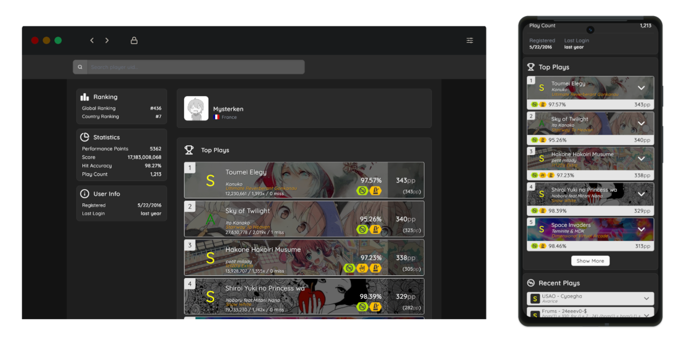

<a id="readme-top"></a>

<br />
<div align="center">
  
  <h3 align="center">osu!droid Profile Viewer</h3>

  <p align="center">
    View detailed stats, top plays, and recent scores for any osu!droid player.
    <br />
    <a href="https://odp.mysterken.com/"><strong>🌐 Visit Live Website</strong></a>
  </p>

[](https://www.codefactor.io/repository/github/mysterken/osudroid-profile)

[](https://github.com/Mysterken/osudroid-profile/blob/master/LICENSE)  

</div>

## 🚀 Getting Started

You can run this project in two ways:

- 🔧 **Locally using Node.js + Yarn**
- 🐳 **Using Docker (dev or production)**

## ✅ Prerequisites

### 🔧 Local Development

- [Node.js](https://nodejs.org/en/download/) (v20 or higher)
- [Yarn](https://yarnpkg.com/getting-started/install)

### 🐳 Docker Setup

- [Docker](https://docs.docker.com/get-docker/)
- [Docker Compose](https://docs.docker.com/compose/)

#### 🔑 API Key

We need an osu! API key to fetch beatmap data. You can get one
from [here](https://osu.ppy.sh/home/account/edit#new-oauth-application).  
Once you have the key, create a `.env` file in the root directory and add the following:

```bash
OSU_CLIENT_SECRET={YOUR_CLIENT_SECRET}
OSU_CLIENT_ID={YOUR_CLIENT_ID}
```

## 📦 Local Setup

### 🔧 Development

```bash
# 1. Install dependencies
yarn install

# 2. Start the dev server
yarn dev
```

App will be available at `http://localhost:3000`

### ⚙️ Production

```bash
# 1. Build the app
yarn build

# 2. Start the server
node build/index.js
```

## 🐳 Docker Setup

### 🔧 Development

```bash
docker compose up -d
```

### ⚙️ Production

```bash
docker compose -f compose.prod.yml up --build -d
```

## 🛠 Tech Stack

- [SvelteKit](https://svelte.dev/)
- [TypeScript](https://www.typescriptlang.org/)
- [Skeleton](https://skeleton.dev/)
- [Tailwind CSS](https://tailwindcss.com/)
- [Lucide Icons](https://lucide.dev/)

## 📌 Features

- osu!droid user lookup by UID
- Top 50 plays with detailed breakdown
- Recent scores display
- Beatmap preview with audio and metadata
- Responsive and mobile-friendly

## 📄 License

MIT © [Mysterken](https://github.com/Mysterken)

## 🙌 Credits

- The [osu!droid](https://github.com/osudroid/osu-droid) team
- Beatmap data from [osu!](https://osu.ppy.sh/)

<p align="right">(<a href="#readme-top">back to top</a>)</p>