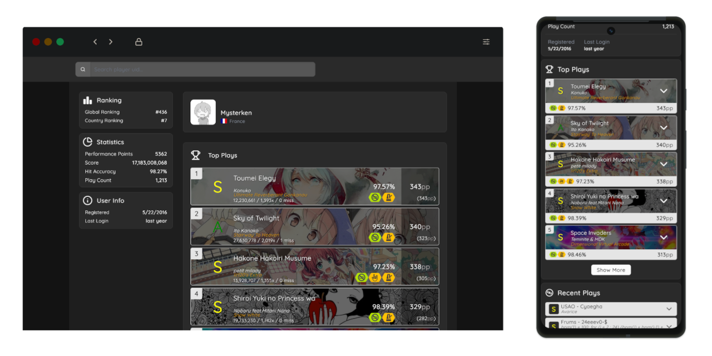

<a id="readme-top"></a>

<br />
<div align="center">
  
  <h3 align="center">osu!droid Hub</h3>

  <p align="center">
    The ultimate hub for osu!droid players. View detailed stats, top plays, recent scores, and explore global leaderboards with advanced filtering.
    <br />
    <a href="https://odp.mysterken.com/"><strong>🌐 Visit Live Website</strong></a>
  </p>

[](https://www.codefactor.io/repository/github/mysterken/osudroid-hub)

[](https://github.com/Mysterken/osudroid-hub/blob/master/LICENSE)  


</div>

---

## 🚀 Getting Started

You can run this project in two ways:

- 🔧 **Locally using Node.js + Yarn**
- 🐳 **Using Docker (dev or production)**

## ✅ Prerequisites

### 🔧 Local Development

- [Node.js](https://nodejs.org/en/download/) (v20 or higher)
- [Yarn](https://yarnpkg.com/getting-started/install)

### 🐳 Docker Setup

- [Docker](https://docs.docker.com/get-docker/)
- [Docker Compose](https://docs.docker.com/compose/)

### 🔑 API Configuration

We need an osu! API key to fetch beatmap data. You can get one from [here](https://osu.ppy.sh/home/account/edit#new-oauth-application).

Once you have the credentials, create a `.env` file in the root directory:

```bash
OSU_CLIENT_SECRET={YOUR_CLIENT_SECRET}
OSU_CLIENT_ID={YOUR_CLIENT_ID}
```

## 📦 Local Setup

### 🔧 Development

```bash
# 1. Install dependencies
yarn install

# 2. Start the dev server (with hot reload)
yarn dev
```

App will be available at `http://localhost:5173`

### ⚙️ Production Build

```bash
# 1. Build the app
yarn build

# 2. Start the production server
node build/index.js
```

App will be available at `http://127.0.0.1:3000`

## 🐳 Docker Setup

### 🔧 Development with Docker

```bash
# Start the development container
docker compose up -d
```

App will be available at `http://localhost:5173`

### ⚙️ Production with Docker

```bash
# Build and start the production container
docker compose -f compose.prod.yml up --build -d
```

App will be available at `http://127.0.0.1:3000`

## 🛠 Tech Stack

- [SvelteKit](https://svelte.dev/) - Modern web framework with SSR
- [TypeScript](https://www.typescriptlang.org/) - Type-safe JavaScript
- [Svelte 5](https://svelte.dev/blog/svelte-5-is-here) - Reactive UI components
- [Tailwind CSS](https://tailwindcss.com/) - Utility-first CSS
- [Lucide Icons](https://lucide.dev/) - Beautiful icon library
- [Axios](https://axios-http.com/) - HTTP client

## 📌 Features

### 👤 Player Profiles

- Search for osu!droid players by **UID** or **username**
- View comprehensive player statistics (PP, accuracy, playcount, etc.)
- Track top 50 plays and recent scores

### 🎵 Beatmap Discovery

- **Global Leaderboards** - See top players ranked by PP or score
- **Advanced Filtering** - Filter by region/country and ranking type
- **Beatmap Leaderboards** - Individual beatmap scoreboards with order by score or PP

## 🎯 Cache Strategy

The application implements a two-tier caching system:

### Server-Side Cache (`src/lib/services/cache.ts`)

- **User profiles**: 10 minutes TTL
- **Leaderboard pages**: 30 seconds TTL (frequently updated)
- **Beatmap scores**: 5 minutes TTL
- **Beatmap metadata**: 1 hour TTL
- **In-memory storage**: Automatically cleared on server restart

### Client-Side Cache (`src/lib/utils/fetchWithLocalCache.ts`)

- **Beatmapset data**: 1 hour TTL (cached in browser localStorage)
- **Beatmap scores**: 5 minutes TTL
- **Automatic cleanup**: Expired entries are removed on next access

**Note:** For multi-instance production deployments, replace in-memory cache with Redis or similar.

## 📁 Project Structure

```
src/
├── routes/                # SvelteKit pages and API endpoints
│   ├── api/               # Backend API routes
│   ├── leaderboard/       # Global and beatmap leaderboards
│   └── users/             # Player profile pages
├── lib/
│   ├── services/          # Business logic & API communication
│   ├── components/        # Reusable Svelte components
│   ├── models/            # TypeScript interfaces
│   ├── utils/             # Helper functions
│   └── actions/           # Svelte actions (tooltip, etc.)
└── app.html               # HTML shell
```

## 🤝 Contributing

Contributions are welcome! Feel free to fork the repository and submit pull requests.

## 📄 License

MIT © [Mysterken](https://github.com/Mysterken)

## 🙌 Credits

- The [osu!droid](https://github.com/osudroid/osu-droid) team for the game and API
- [osu!](https://osu.ppy.sh/) for beatmap data and official API

---

<p align="right">(<a href="#readme-top">back to top</a>)</p>
